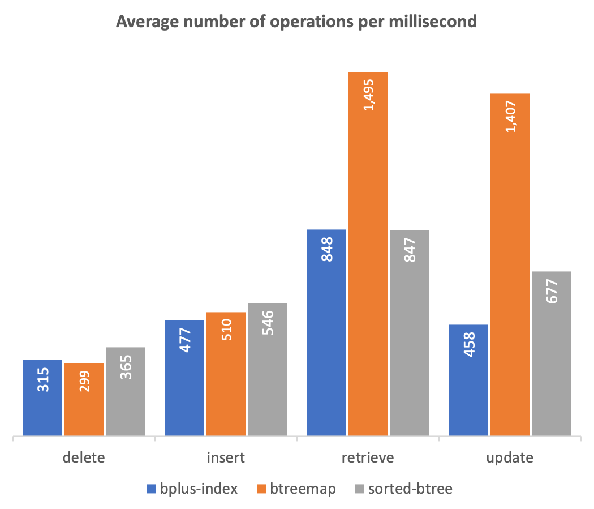

# btreemap

   

A `BTreeMap` is an indexed, sorted, type-aware, and persistable data store with a Map-like API and extensions for range-based methods. At it's core is a `Map` object, used to store key/value pairs, and a [B+ Tree](https://en.wikipedia.org/wiki/B%2B_tree) for managing keys. This "best of both worlds" approach leverages the strengths of each: the efficient data access of a `Map`, and the sorting and range benefits of a B+ Tree. In benchmark tests, `BTreeMap` significantly outperforms the B+ Tree libraries [sorted-btree](https://www.npmjs.com/package/sorted-btree) and [bplus-index](https://www.npmjs.com/package/bplus-index) when retrieving and updating existing values, and performs comparably on insertion and deletion tasks (see [Benchmarks](#benchmarks) for details).

There is one important way in which a `BTreeMap` is different from a `Map`. The design inspiration comes from database indexes that can enforce unique keys constraints or allow  keys to have multiple related values. A `BTreeMap` can be similarly configured either way. When keys are unique, a `BTreeMap` effectively functions the same as a `Map`, with the added benefit of key sorting and range-based access. When keys are non-unique, each key can have an array of associated values, and this has several implications:

* The `get` method returns an array of values for a key, as opposed to returning a single value.
* The `delete` method removes the entire array of values associated with a key, as opposed to deleting just a single value.
* The `values` iterator yields a result for each individual element of a key's array of associated values.
* The `entries` iterator yields a key/value pair for each individual element of a key's array of associated values, as opposed to a single key/value pair per key.
* The `forEach` method, being based on the `entries` iterator, applies the supplied function to each individual element of a key's array of associated values.

By default, a `BTreeMap` is configured for unique keys.

## Examples

### Unique keys
```js
const { BTreeMap } = require("btreemap");

const btm = new BTreeMap();
btm.set(1, "one");
btm.get(1); // returns "one"
btm.set(1, "two"); // overwrites "one" with "two"
btm.get(1); // returns "two"
dtm.delete(1) // deletes key 1 and value "two"
```

### Non-unique keys

```js
const { BTreeMap } = require("btreemap");

const btm = new BTreeMap({unique: false});
btm.set(1, "one");
btm.get(1); // returns ["one"]
btm.set(1, "two"); // adds "two" for key 1
btm.get(1); // returns ["one", "two"]
btm.delete(1); // deletes key 1 and values "one" and "two"
```

There are two other important factors to be aware of: the use of [BSON](https://www.npmjs.com/package/bson) to serialize and deserialize data with persistent storage; and the default comparator used to determine the sort order of keys.

While a `Map` key or value can be any primitive or object, BSON cannot effectively serialize all of them, so if you attempt to save a `BTreeMap` that contains certain types of keys or values it may result in an error. In particular, the following primitives and object types are "safe": `null`, `boolean`, `number`, `Date`, `string`, `RegExp`, `Array`, and `Object` (that is, `[object Object]`). The BSON library will convert any `undefined` keys or values to `null`, will fail on `bigint`, and may not serialize other types of objects as you'd expect. When using `BTreeMap` completely in-memory, none of theses restrictions apply.

By default, `BTreeMap` uses a type-aware comparator function to compare and determine the sort order of keys. If two keys being compared are of the same type (`null` keys have their type converted from `object` to `null`), they are compared using the "less than" (`<`) operator and the [Abstract Relational Comparison](https://tc39.es/ecma262/#sec-abstract-relational-comparison) algorithm. If the keys are of different types, they are compared lexicographically using their type name. This results in a somewhat arbitrary ordering of differing types, but any ordering of types is bound to be somewhat arbitrary. If desired, a custom comparator function can be supplied when creating a `BTreeMap` instance.

## Table of contents
 - [Constructor](#constructor)
 - [Properties](#properties)
 - [Data manipulation methods](#data-manipulation-methods)
 - [Iterators](#iterators)
 - [Functional methods](#functional-methods)
 - [Input/Output methods](#inputoutput-methods)
 - [Benchmarks](#benchmarks)

## Constructor

#### Syntax

	new BTreeMap([options]);

#### Parameters

`options`

An object containing configuration options for the `BTreeMap`.

Option|Type|Description|Default
------|----|-----------|-------
`unique`|boolean|Whether keys are unique|`true`
`order`|number|The order of the B+ Tree|`3`
`comparator`|function|The function used to compare keys|Described above.

If a custom comparator is provided, it must take two values as input and return a value less than zero if the first value should be sorted before the second, greater than zero if the second value should be sorted before the first, or zero to keep the existing order.

#### Examples

```js
const btm = new BTreeMap({
	unique: false,
	order: 5,
	comparator: (a, b) => {
		return (a < b) ? -1 : ((a > b) ? 1 : 0);
	}
});
```

## Properties

### BTreeMap.lowest

Returns the lowest key in the `BTreeMap`.

### BTreeMap.highest

Returns the highest key in the `BTreeMap`.

### BTreeMap.order

Returns the order of the `BTreeMap` object's B+ Tree.

### BTreeMap.size

Returns the number of keys in a `BTreeMap` object. If configured for unique keys, this will be equal to the number of values; otherwise, the number of values may be greater.

### BTreeMap.stats

Returns an object with statistics for a `BTreeMap` object's B+ Tree:

Property|Description
--------|-----------
`depth`|The depth of the tree
`nodes`|The number of nodes in the tree
`leaves`|The number of leaves in the tree
`keys`|The number of keys in the tree
`values`|The number of values in the tree

The number of `keys` in the tree will be equal to the `size` of the `BTreeMap`, but the number of values could be greater if configured for non-unique keys.

## Data manipulation methods

### BTreeMap.has()

Returns a boolean indicating whether the specified key exists.

#### Syntax

	has(key)

#### Parameters

`key`

The key to test for presence in the `BTreeMap` object.

#### Return value

`true` if the specified key exists in the `BTreeMap` object; otherwise, `false`.

### BTreeMap.set()

Adds a value for a specified key to a `BTreeMap` object. If configured for unique keys, overwrites the value if the key exits; otherwise, adds the value to the array of values for the key.

#### Syntax

	set(key, value)

#### Parameters

`key`

The key to add to the `BTreeMap` object.

`value`

The associated value to add to the `BTreeMap` object.

#### Return value

The `BTreeMap` object.

### BTreeMap.get()

Returns a value associated with a specified key from a `BTreeMap` object or an iterator object for the values associated with a range of keys.

#### Syntax

	get(key [, endKey, inclusive])

#### Parameters

`key`

The key for the associated value to return from the `BTreeMap` object.

`endKey`

 If an `endKey` is provided, `get()` returns a new iterator object for values in the `BTreeMap` object, from `key` to `endKey`, in sorted order.

`inclusive`

A boolean indicating whether to include the associated value for the `endKey`. Default is `true`.

#### Return value

The value associated with the specified key, or values associated with a range of keys, or `undefined` if the key, or keys in the range, can't be found in the `BTreeMap` object.

#### Examples

```js
// Returns the value associated with key 1
btm.get(1);

// Returns an iterator for the values associated with keys 1 through 10
btm.get(1, 10);

// Returns an iterator for the values associated with keys 1 up to but not including 10
btm.get(1, 10, false);
```

### BTreeMap.delete()

Removes the specified key and its associated value, or range of keys and associated values, from a `BTreeMap` object.

#### Syntax 

	delete(key [, endKey, inclusive])

#### Parameters

`key`

The key to remove from the `BTreeMap` object.

`endKey`

If an `endKey` is provided, `delete()` removes keys in the range from `key` to `endKey` from the `BTreeMap` object.

`inclusive`

A boolean indicating whether to include the `endKey`. Default is `true`.

See `get` for examples of how `endKey` and `inclusive` can be used.

#### Return value

`true` if a key, or range of keys, in the `BTreeMap` object existed and have been removed, or `false` if the key does not exist, or there are no keys in the range.

### BTreeMap.clear()

Removes all elements from a `BTreeMap` object.

#### Syntax

	clear()

#### Return value

`undefined`

## Iterators

### BTreeMap.keys()

Returns a new iterator object that contains the keys in the `BTreeMap` object in sorted order.

#### Syntax

	keys([start, end, inclusive])

If `start` or `end` are provided, returns keys within the range from `start` to `end`.

#### Parameters

`start`

The lowest key that should be included in the iterator. Default is the lowest key in the `BTreeMap` object.

`end`

The highest key that should be included in the iterator. Default is the highest key in the `BTreeMap` object.

`inclusive`

A boolean indicating whether to include the `end` element. Default is `true`.

#### Return value

A new `BTreeMap` iterator object.

#### Examples

```js
// Returns an iterator for all keys
btm.keys();

// Returns an iterator for keys 1 through 10
btm.keys(1, 10);

// Returns an iterator for keys from the lowest key to 10
btm.keys(undefined, 10)

// Returns an interator for keys 10 up through the highest key
btm.keys(10, undefined);

// Returns an iterator for keys 1 up to but not including 10
btm.keys(1, 10, false)
```

### BTreeMap.values()

Returns a new iterator object that contains the values in the `BTreeMap` object sorted by key order.

#### Syntax

	values([start, end, inclusive])

If `start` or `end` are provided, returns values for keys within the range from `start` to `end`. Note that if configured for non-unique keys, each value yielded will be an array of values.

#### Parameters

`start`

The lowest key that should be included in the iterator. Default is the lowest key in the `BTreeMap` object.

`end`

The highest key that should be included in the iterator. Default is the highest key in the `BTreeMap` object.

`inclusive`

A boolean indicating whether to include the `end` element. Default is `true`.

See `keys` for examples of how `start`, `end`, and `inclusive` can be used.

#### Return value

A new `BTreeMap` iterator object.

### BTreeMap.entries()

Returns a new iterator object that contains the [key, value] pairs in the `BTreeMap` object sorted by key order. Note that if configured for non-unique keys, a [key, value] pair will be yielded for each value in a key's array of associated values; that is, more than one [key, value] pair may be yielded for a given key.

#### Syntax

	entries([start, end, inclusive])

If `start` or `end` are provided, returns [key, value] pairs for keys within the range from `start` to `end`.

#### Parameters

`start`

The lowest key that should be included in the iterator. Default is the lowest key in the `BTreeMap` object.

`end`

The highest key that should be included in the iterator. Default is the highest key in the `BTreeMap` object.

`inclusive`

A boolean indicating whether to include the `end` element. Default is `true`.

See `keys` for examples of how `start`, `end`, and `inclusive` can be used.

#### Return value

A new `BTreeMap` iterator object.

## Functional methods

### BTreeMap.forEach()

Executes a provided function once per each key/value pair in the `BTreeMap` object in sorted order. If configured for non-unique keys, applies the supplied function to each individual element of a key's array of associated values.

#### Syntax

	forEach(function, [start, end, inclusive])

If `start` or `end` are provided, executes the function for keys within the range from `start` to `end`.

#### Parameters

`function`

The function to be executed, invoked with three arguments: the value, the key, and the `BTreeMap` object.

`start`

The lowest key for which the function should be executed. Default is the lowest key in the `BTreeMap` object.

`end`

The highest key for which the function should be executed. Default is the highest key in the `BTreeMap` object.

`inclusive`

A boolean indicating whether to execute the function for the `end` element. Default is `true`.

See `keys` for examples of how `start`, `end`, and `inclusive` can be used.

#### Return value

`undefined`

## Input/Output methods

### BTreeMap.load()

Creates a new `BTreeMap` object using data from a file.

#### Syntax

	load(path)

#### Parameters

`path`

The path to a file containing `BTreeMap` data.

#### Return value

`undefined`

### BTreeMap.save()

Saves a `BTreeMap` map object's data to a file.

#### Syntax

	save(path)

#### Parameters

`path`

The path to a file where the `BTreeMap` object's data should be saved. The file is created if it doesn't exist, and overwritten if it does.

#### Return value

`undefined`

### BTreeMap.toString()

Returns a string representing the `BTreeMap` object.

#### Syntax

	toString()

#### Return value

A string representing the `BTreeMap` object.

## Benchmarks

Twenty rounds of benchmark tests were conducted to compare `btreemap` with `sorted-btree` and `bplus-index`. Each test involved the following for ascending and descending integer keys, and a randomly generated mix of integer and character keys:
* Inserting key/value pairs in batches of 1000, 10000, 100000, and 1000000
* Retrieving values for a random 20% of the keys
* Updating values for a random 10% of the keys
* Deleting a random 1% of the keys

Times were captured at nanosecond scale using `process.hrtime.bigint()` and the results were converted into measures of operations per millisecond. The benchmark script, raw data output, and an Excel spreadsheet with a pivot chart, are all available in the "benchmarks" folder.


